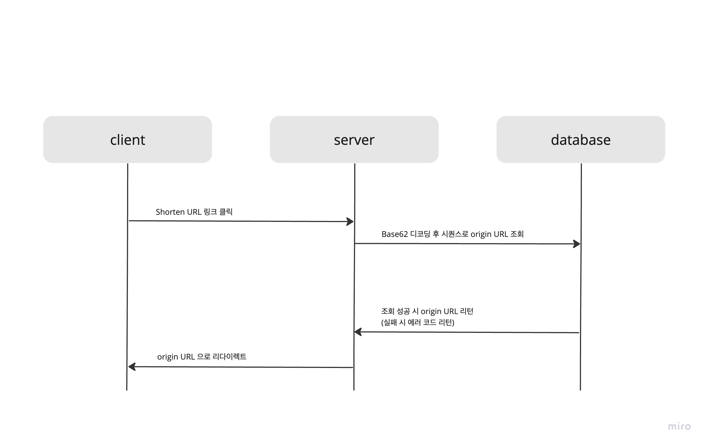

# URL Shortener

- 불필요하게 긴 URL 을 사용하는 대신, 단축 URL 을 사용하여 사용자의 편의를 높이도록 URL Shortener 서비스 개발
- 암호화 한 shorten URL 을 생성하여 시퀀스 번호가 그대로 노출되는 문제점을 방지

## Flow



### Encode

1. 시퀀스와 원본 URL 저장
2. 시퀀스를 Base62 encode => encoded URL(shorten URL) 생성
3. shorten URL 리턴

### Decode

1. encodedId 를 Base62 decode => 시퀀스 정보 추출
2. DB 에서 시퀀스로 origin URL 조회
3. origin URL 리다이렉트

## Database

Auto increment 되는 시퀀스를 1 부터 설정한다면 역시 시퀀스 순서를 유추할 수 있게 되기 때문에, 초기값을 100000 과 같이 큰 숫자부터 시작

```roomsql
-- test_db.url definition

CREATE TABLE `url` (
`id` int NOT NULL AUTO_INCREMENT,
`created_at` datetime(6) DEFAULT NULL,
`deleted_at` datetime(6) DEFAULT NULL,
`updated_at` datetime(6) DEFAULT NULL,
`created_by` varchar(255) DEFAULT NULL,
`origin_url` varchar(255) DEFAULT NULL,
`updated_by` varchar(255) DEFAULT NULL,
PRIMARY KEY (`id`)
) ENGINE=InnoDB AUTO_INCREMENT=100000 DEFAULT CHARSET=utf8mb4 COLLATE=utf8mb4_0900_ai_ci;
```

## API Specifications

1. shorten URL 생성

- Method: POST
- URI: /api/v1/url-shortener
- Request: (RequestParam)

```
originUrl=`string`
- ```

- Response:

```json
{
  "timestmap": "2023-08-14T13:13:20.972432",
  "code": 200,
  "codeName": "OK",
  "desc": "OK",
  "data": "NtS"
}
```

2. origin URL 조회

- Method: GET
- URI: /api/v1/url-shortener/{encodedId}
- Request:

```jsonpath
/api/v1/url-shortener/NtS
```

- Response: redirect to origin URL
    - `originUrl=http://localhost:8080/api/v1/url-shortener/redirect-url` 으로 POST 요청 시, 아래 메세지가 노출되는
      화면으로 리다이렉트
    ```jsonpath
    redirect here!
    ```

    - 그 외에는 404 Not Found
